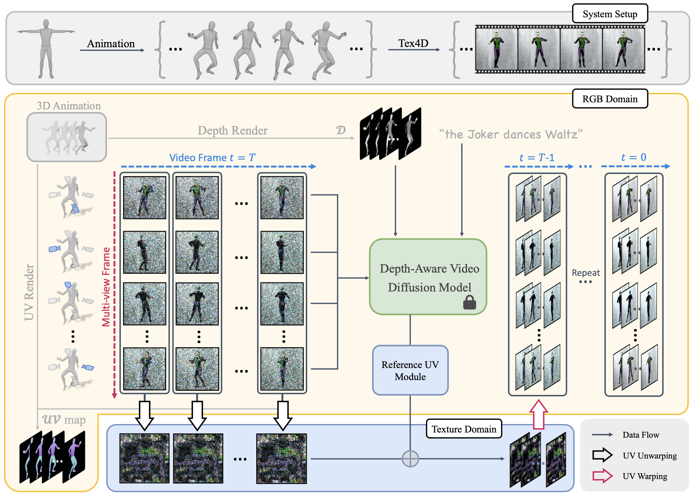

<h1 align="center"><a href="https://tex4d.github.io/">Tex4D: Zero-shot 4D Scene Texturing
with Video Diffusion Models
</a></h2>

[](https://tex4d.github.io/)
[](https://arxiv.org/) 
[](https://www.apache.org/licenses/LICENSE-2.0) 

We present **Tex4D**, a zero-shot approach that integrates inherent 3D geometry knowledge from mesh sequences with the expressiveness of video diffusion models to produce multi-view and temporally consistent 4D textures. Given an untextured mesh sequence and a text prompt as inputs, our method generates multi-view, temporally consistent 4D textures.



- [ ] Technical Report
- [ ] Release inferencecode
- [ ] Release data preprocess code

## Installation

Please first run following commands to build dependencies:
```bash
git clone https://github.com/ZqlwMatt/Tex4D.git
cd Tex4D
conda create -n tex4d python=3.8
conda activate tex4d
pip install -r requirements.txt
```

Then install PyTorch3D through the following URL (check and replace your CUDA verison by running `pytorch3d_install.py`)
```bash
pip install --no-index --no-cache-dir pytorch3d -f https://dl.fbaipublicfiles.com/pytorch3d/packaging/wheels/py38_cu117_pyt200/download.html
```

## Quick Start

### 1. Preprocess

Generate the conditioning data for video diffusion model for the provided mesh sequences.

```bash
python visualize.py --render --data_folder "anim/boo" --pose_dir "pose_3" --load_from_data
```

### 2. Run

```bash
python run.py --config data/boo/config.yaml
```

## Sample results

For more see our [project webpage](https://tex4d.github.io).

https://github.com/user-attachments/assets/1ec1cc6e-34b5-4cb6-a175-1894bf69360f

https://github.com/user-attachments/assets/3b80a0ed-b201-469d-8cc8-137e82abefa2

https://github.com/user-attachments/assets/e4ca6c1b-3a3b-4da1-9bb8-9c217d48e100

## Citation

```bibtex

```


<!-- This work is built on many amazing research works and open-source projects, thanks all the authors for sharing! -->
